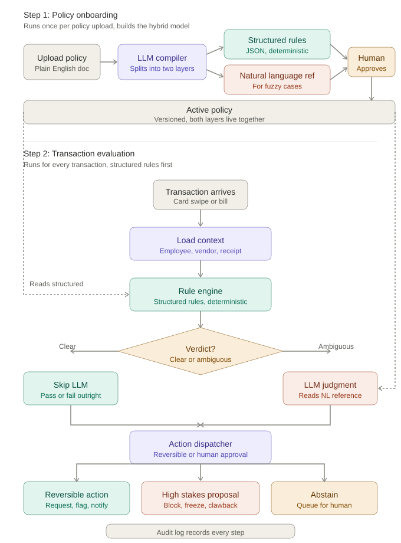
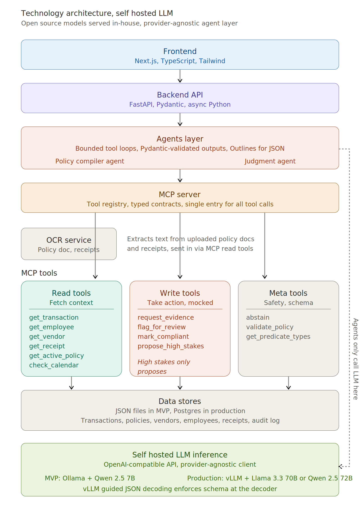

# Reap Policy Enforcement Agent

An AI agent that evaluates employee card spend against company policy. It ingests natural-language policies, compiles them into a hybrid rule representation, and evaluates every transaction — returning a verdict, taking an action, and writing a full audit trail.

---

## High-Level Workflow



The agent runs in two phases:

1. **Policy onboarding** — the LLM compiler reads the uploaded policy and splits it into structured rules (deterministic checks) and natural-language references (clauses requiring judgment). A human approves the compiled policy before it goes live.
2. **Transaction evaluation** — structured rules run first. The LLM is invoked only when the rule engine returns `needs_judgment`. Every decision is written to an append-only audit log.

---

## Technology Architecture



| Layer | Component | Technology |
|---|---|---|
| Frontend | Dashboard: policy upload, transaction test, decision viewer | Next.js (React) |
| Backend | FastAPI service, rule engine, orchestrator | Python 3.11 + FastAPI |
| LLM | Judgment agent for ambiguous cases | Qwen 2.5 7B via Ollama |
| Agent tools | Read / write / meta tools served as MCP tools | `mcp_server/` package |
| Storage (MVP) | Policies, audit log, transactions, receipts | JSON flat files |
| Storage (prod) | Same interface, different driver | Postgres on RDS |

The LLM is accessed through an OpenAI-compatible client, so the model is a single config change. Storage sits behind a simple interface for the same reason.

---

## Why Hybrid Policy Representation

Pure LLM enforcement is non-deterministic and leaves no audit trail. Pure rule-based enforcement cannot handle contextual clauses like _"alcohol is reimbursable only when clients are present."_ The hybrid model uses both:

| Clause type | Evaluation layer | Example |
|---|---|---|
| Measurable threshold | Structured rule | `amount > $75 → receipt required` |
| Categorical ban | Structured rule | `vendor in [Competitor Corp] → block` |
| Conditional interpretation | NL reference + LLM | "clients present", "reasonable", "good judgment" |
| Context-dependent | NL reference + LLM | Attendee list, calendar cross-check, purpose statement |

The LLM is a fallback, not the primary evaluator. Deterministic accuracy stays at 100% for measurable cases.

---

## Autonomy Model

The agent's autonomy is proportional to the reversibility of the action.

**Agent acts automatically:**
- Mark transaction compliant
- Request receipt / evidence
- Flag for finance review
- Send employee notification

**Human approval required:**
- Clawback / payroll deduction
- Card suspension
- HR / legal escalation
- Block at pre-authorization

High-stakes actions are queued via `propose_high_stakes_action` and never auto-executed.

---

## Project Structure

```
.
├── policy_agent_high_level_hybrid.svg   # workflow diagram
├── tech_architecture_open_source_llm.png  # stack diagram
├── Policy_Enforcement_Agent_Documentation.md  # full design doc
└── reap-policy-agent/
    ├── backend/
    │   └── app/
    │       ├── api.py               # FastAPI endpoints
    │       ├── schemas.py           # Pydantic data models
    │       ├── agents/
    │       │   ├── judgment_agent.py  # LLM tool-calling loop
    │       │   └── policy_compiler.py
    │       └── services/
    │           ├── orchestrator.py  # end-to-end evaluate()
    │           ├── rule_engine.py   # deterministic checks
    │           ├── action_dispatcher.py
    │           ├── audit_log.py
    │           └── policy_store.py  # versioning + lifecycle
    ├── mcp_server/
    │   ├── server.py
    │   ├── tools/
    │   │   ├── read_tools.py   # get_transaction, get_employee, get_receipt, …
    │   │   ├── write_tools.py  # flag_for_review, mark_compliant, notify_manager, …
    │   │   └── meta_tools.py   # abstain, validate_policy, get_predicate_types
    │   └── data/               # mock tenant data (Meru Inc)
    ├── frontend/               # Next.js dashboard
    └── scripts/
        ├── compile_policy.py
        ├── review_policy.py
        ├── run_demo.py
        └── run_eval.py
```

---

## API Endpoints

| Method | Path | Description |
|---|---|---|
| `POST` | `/evaluate` | Evaluate a transaction end-to-end; returns a `Decision` |
| `GET` | `/decisions` | List recent decisions from the audit log |
| `GET` | `/decisions/{transaction_id}` | Full audit trail for one transaction |
| `GET` | `/policy/active` | Active compiled policy for a tenant |
| `POST` | `/policies/upload` | Upload a `.txt` policy file for a tenant |
| `POST` | `/policies/{policy_id}/approve` | Approve a draft and make it the active policy |

---

## Quick Start

### Prerequisites

- Python 3.11+
- [Ollama](https://ollama.com) with `qwen2.5:7b-instruct` pulled
- Node.js 18+ (frontend only)

### 1. Pull the model

```bash
ollama pull qwen2.5:7b-instruct
```

### 2. Install backend dependencies

```bash
cd reap-policy-agent/backend
pip install -e ".[dev]"
```

### 3. Start the backend

```bash
cd reap-policy-agent/backend
uvicorn app.api:app --reload --port 8000
```

### 4. Start the frontend (optional)

```bash
cd reap-policy-agent/frontend
npm install
npm run dev
```

The dashboard is available at `http://localhost:3000`.

### 5. Run the demo

```bash
cd reap-policy-agent
python scripts/run_demo.py
```

### 6. Run the evaluation harness

```bash
cd reap-policy-agent
python scripts/run_eval.py
```

---

## Running Tests

```bash
cd reap-policy-agent/backend
pytest
```

---

## Mock Data

Tenant: **Meru Inc** (`meru-inc`). All data lives in `mcp_server/data/` and is replaced by live Reap API calls in production.

- **5 employees** across Sales, Engineering, Marketing
- **16 vendors** (2 blocklisted: Competitor Corp, RivalCo)
- **16 transactions** covering compliant, failing, ambiguous, and adversarial scenarios
- **4 receipts** (including one with alcohol line items and no attendee note)
- **Active policy version 5** with 4 structured rules + 1 NL reference

---

## Policy Lifecycle

```
draft  →  approved  →  active  →  deprecated
```

Exactly one policy can be `active` per tenant at any moment. Deprecated policies are never deleted — every historical decision references the policy version that produced it.

---

## Environment Variables

| Variable | Default | Description |
|---|---|---|
| `OLLAMA_BASE_URL` | `http://localhost:11434` | Ollama server URL |
| `OLLAMA_MODEL` | `qwen2.5:7b-instruct` | Model used for judgment |

---

## Production Path

The MVP runs entirely on a laptop with no API costs. The same code moves to production as a config change:

| Component | MVP | Production |
|---|---|---|
| Backend | FastAPI + uvicorn | AWS Lambda + API Gateway |
| LLM | Ollama (Qwen 2.5 7B) | HuggingFace / Together AI / Bedrock |
| Storage | JSON flat files | Postgres on RDS |
| Audit log | Append-only JSONL | S3 or dedicated audit table |
